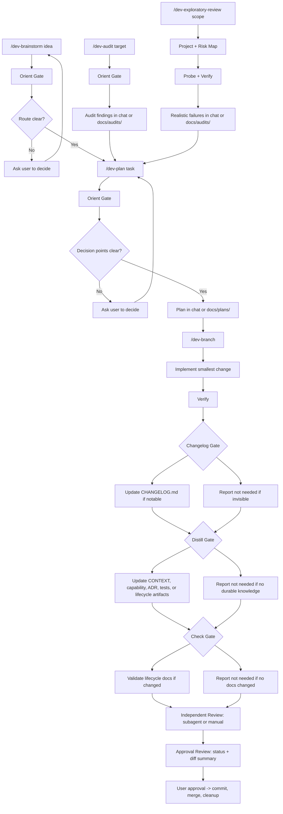

# cuberhyk-dev-flow

cuberhyk-dev-flow is a lifecycle workflow plugin for coding agents. It helps agents enter a
repository with low noise, plan only after decision readiness, audit with evidence, implement in a
reviewed branch, update release notes only when useful, and distill durable knowledge before the
task is committed.

It is designed for larger projects where repeated AI sessions can otherwise accumulate too many
plans, TODOs, audit reports, stale notes, and half-remembered decisions.

Open the official static website:

```text
docs/index.html
```

Legacy `docs/usage.html` redirects to the new multi-page site.

## Core Idea

The plugin separates four kinds of information:

| Kind | Purpose | Default context? |
|---|---|---|
| Current facts | What the system does now | Yes, when relevant |
| Decisions | Why an important long-term choice was made | Only for decision tasks |
| Process artifacts | Plans and audits that helped the task happen | No |
| Executable truth | Tests and code that enforce behavior | Yes, through targeted reading |

Guiding rule:

```text
Current facts stay current. Process artifacts get closed. Old process noise is not default context.
```

## Language Policy

Dev Flow defaults to Chinese for user-facing replies and documents it creates. An explicit user
language request or the repository's documented language convention takes precedence. Code, commands,
APIs, identifiers, paths, configuration keys, and required schema/status values remain in English.

## User-Facing Flow

The daily user flow is intentionally short:

For fuzzy ideas or unclear product/workflow changes:

```text
/dev-brainstorm <idea to clarify>
/dev-plan <confirmed route>
/dev-branch <implement the approved plan>
```

For a new project's initial UI:

```text
/dev-brainstorm <discuss product and UI direction>
<agent produces representative UI; user reviews and approves it>
/dev-design-system <initialize the confirmed durable UI contract>
/dev-plan <plan implementation>
/dev-branch <implement with the Design System Gate>
```

For clear tasks:

```text
/dev-plan <what you want to do>
/dev-branch <implement the approved plan>
```

For large-file, module-boundary, or code-organization risk:

```text
/dev-split <file, module, or planned change>
/dev-plan <embed the split guidance into the execution route>
/dev-branch <implement the confirmed route>
```

For review-driven work:

```text
/dev-audit <what to inspect>
/dev-plan <turn findings into a fix plan>
/dev-branch <implement the fix plan>
```

For open-ended risk discovery:

```text
/dev-exploratory-review <optional project path, module, feature, flow, branch, or files>
/dev-plan <turn confirmed failures into a fix plan>
/dev-branch <implement the fix plan>
```

For repository health:

```text
/dev-init   # first-time project adoption
/dev-check  # routing, lifecycle, git visibility, changelog, ADR hints
```

`dev-orient`, `dev-split`, `dev-changelog`, and `dev-distill` still exist as standalone skills, but normal users
do not need to remember them for every task. `dev-brainstorm`, `dev-plan`, `dev-audit`, and
`dev-exploratory-review` include built-in orientation. `dev-plan` routes split-sensitive work to
`dev-split`, and `dev-branch` includes lifecycle gates plus an independent subagent-or-manual review before approval.

## Flow Diagram



## Skills

| Skill | Responsibility | Must not do | Typical next step |
|---|---|---|---|
| `dev-init` | Create the minimum repository memory structure and templates. | Infer all project knowledge, write plans, or audit code. | `dev-check` |
| `dev-check` | Validate document routing, lifecycle status, changelog shape, ADR hints, and git visibility. | Do deep business review or rewrite docs. | `dev-init`, `dev-plan`, `dev-audit`, or `dev-distill` |
| `dev-orient` | Enter repository context by reading only stable entry docs and relevant capability docs. | Plan, audit, implement, or distill. | `dev-plan` or `dev-audit` |
| `dev-brainstorm` | Clarify fuzzy ideas, compare approaches, and confirm decisions before planning. | Write executable plans, audit findings, or implementation code. | `dev-plan`, `dev-audit`, `dev-exploratory-review`, or `dev-orient` |
| `dev-design-system` | Initialize, update, or check the durable project UI contract, tokens, and semantic reuse rules. | Invent unseen UI scenarios or replace component code and task plans. | User review, `dev-plan`, or continued `dev-branch` gates |
| `dev-split` | Classify large-file, module-boundary, and code-placement risk; produce split guidance or guardrails. | Implement code without an approved plan, chase line-count targets, or replace `dev-plan`. | `dev-plan` or `dev-branch` |
| `dev-plan` | Run orient gate, check decision readiness, then create a verifiable plan. | Implement, audit, close artifacts, or silently decide product/business choices. | `dev-branch` |
| `dev-audit` | Run orient gate, produce evidence-based findings for bounded audits, and persist non-trivial audits. | Implement fixes, discover unknown risks across a project, or update capability facts directly. | `dev-plan` or `dev-branch` |
| `dev-exploratory-review` | Map a project or bounded scope, build a risk map, run focused probes/tests, and report only realistic failures. | Implement fixes or comment on style, naming, formatting, or subjective preferences. | `dev-plan` or `dev-branch` |
| `dev-branch` | Implement inside an isolated Git branch with lifecycle gates and an independent subagent-or-manual review before commit. | Mix unrelated changes, skip review, push automatically, or defer same-task distillation. | `dev-check` |
| `dev-changelog` | Maintain `CHANGELOG.md` for notable user/operator/release changes. | Replace git history, ADRs, capability docs, task plans, or log tiny internal changes. | `dev-branch` review gate |
| `dev-distill` | Move durable knowledge to the right long-lived place and close plans/audits. | Re-plan, re-audit, or implement. | `dev-check` |

## Gate Responsibilities

| Gate | Where it runs | Purpose | Output |
|---|---|---|---|
| Orient Gate | `dev-plan`, `dev-audit`, or standalone `dev-orient` | Load AGENTS/CLAUDE, CONTEXT, context-map, relevant capability docs, and key code only. | Context sources and likely artifact routes. |
| Brainstorm Gate | `dev-brainstorm` | Clarify fuzzy intent, compare approaches, and confirm the next route before planning. | Confirmed goal, decisions, alternatives, and next skill. |
| Design System Gate | `dev-design-system`, or UI work inside `dev-branch` | Reuse existing semantic patterns, update confirmed reusable rules, and check UI compliance. | Updated/passed `DESIGN.md`, tokens, components, and visual/accessibility verification, or a concrete "not needed" reason. |
| Split Gate | `dev-split`, or split-sensitive planning through `dev-plan` | Classify no split, local cleanup, defer, or proposed split, and define owner modules plus code-placement constraints. | Split guidance, defer trigger, proposed split awaiting approval, or concrete "not needed" reason. |
| Decision Gate | `dev-plan` | Identify unresolved product, data, lifecycle, cleanup, or architecture decisions before planning. | Decision request or confirmed execution route. |
| Changelog Gate | `dev-branch`, or standalone `dev-changelog` | Decide whether the change is notable for users, operators, public APIs, data, security, install, config, compatibility, or release notes. | Updated `CHANGELOG.md` or a concrete "not needed" reason. |
| Distill Gate | `dev-branch`, or standalone `dev-distill` | Capture durable knowledge and close plans/audits before review. | Updated CONTEXT, capabilities, ADRs, context-map, tests, archives, or a concrete "not needed" reason. |
| Check Gate | `dev-branch`, or standalone `dev-check` | Validate lifecycle routing after docs or process artifacts changed. | Errors/warnings/recommendations, or a concrete "not needed" reason. |
| Independent Review Gate | `dev-branch` | Check plan compliance, audit coverage, related-only changes, verification evidence, and lifecycle gates using a focused read-only subagent when useful or the same manual review otherwise. | Pass/fail/not-applicable results and blockers verified by the main agent. |
| Approval Review Gate | `dev-branch` | Show status, changed files, and a concise diff summary before any commit, merge, branch delete, or push. | User approval request. |

## Output Templates

Each skill has a dedicated final-response template:

```text
skills/<skill-name>/templates/output.md
```

`SKILL.md` keeps the workflow rules and points to the template. Slash commands also require the
same template shape, so `/dev-brainstorm`, `/dev-split`, `/dev-plan`, `/dev-audit`, `/dev-branch`, `/dev-changelog`, `/dev-distill`,
and the other commands produce consistent responses across agent harnesses.

Use the templates as the source of truth for response structure:

- `dev-brainstorm` has ready, blocked-by-decisions, and continue-brainstorming shapes.
- `dev-split` has classification, deferred, split proposal, and blocked shapes.
- `dev-branch` has separate `Before Approval` and `After Merge` sections, and reports lifecycle
  gates plus an independent subagent-or-manual review before approval.
- `dev-plan` has separate ready and decision-blocked shapes.
- `dev-changelog` always reports updated, not needed, release prepared, or blocked.
- `dev-distill` always reports durable updates and plan/audit/ADR closeout.
- `dev-check` always reports errors, warnings, recommendations, and the next step.

## Plan Readiness Gate

`dev-plan` does not start by writing a plan. It first orients, then asks whether the task is
plan-ready.

For fuzzy ideas, use `dev-brainstorm` before `dev-plan`. Brainstorming confirms goal, non-goals,
approach tradeoffs, and user-owned decisions. It stays chat-only by default and does not create
executable plans.

A task is plan-ready only when:

- the goal is clear;
- scope and non-goals are clear enough to prevent drift;
- the relevant source of truth is known or discoverable from code/docs;
- key product, business, data, state, cleanup, or architecture decisions are confirmed;
- the validation path is known or can be defined.

If critical decisions are unresolved, `dev-plan` must stop at a decision request and ask the user
to confirm the route. It should not create or update a formal plan file yet.

If the task touches large files, module ownership, shared state, side effects, test boundaries, or
code-placement risk, `dev-plan` must use or recommend `dev-split` before writing implementation
steps. The plan should include only the selected `dev-split` result: classification, owner modules,
guardrails, deferred trigger, verification, and lifecycle closeout.

Decision points must be called out when:

- multiple reasonable approaches exist;
- the choice affects user experience or visible workflow;
- the choice affects business semantics;
- the choice affects data meaning, source of truth, or state transitions;
- the choice performs irreversible or hard-to-undo cleanup;
- the choice changes long-term architecture direction;
- the choice may require an ADR later.

Formal plan files should contain one confirmed execution route. Avoid unresolved `Option A /
Option B` branches in executable steps.

## Reviewed Branch Gate

`dev-branch` runs implementation inside an isolated Git branch.

It does not require a perfectly clean worktree. It requires an attributable worktree:

- Related Dev Flow artifacts such as `docs/plans/*.md` or `docs/audits/*.md` may move onto the
  task branch when they clearly belong to the task.
- Unrelated or ambiguous source, config, dependency, test, generated, or documentation changes
  must stop the workflow. The agent must show `git status`, changed files, and a concise diff summary, then ask the user how to
  handle them.
- A plan created by `dev-plan` before `dev-branch` does not need to be committed first.

Branch naming rule:

```text
task/YYYYMMDD-short-task-slug
```

Before commit or merge, `dev-branch` must show:

```bash
git status --short --branch --untracked-files=all
git diff  # inspect locally; summarize by default instead of printing the full diff
```

Review output must include:

- branch name;
- existing changes before branch;
- changed files;
- verification;
- changelog gate result;
- distill gate result;
- check gate result;
- independent review mode, compliance/coverage results, verification evidence, and blockers;
- status and diff summary;
- explicit approval request.

Approval to commit and merge is not approval to push. `dev-branch` must never run `git push`
unless the user separately asks and confirms push.

## Changelog Gate

`dev-changelog` maintains `CHANGELOG.md` using Keep a Changelog conventions:

```text
## [Unreleased]
### Added
### Changed
### Deprecated
### Removed
### Fixed
### Security
```

Write a changelog entry when a change affects:

- users or visible product behavior;
- operators, installation, setup, configuration, or deployment;
- public APIs, commands, skills, manifests, or package behavior;
- data meaning, migrations, compatibility, or persistence;
- security, auth, permissions, secrets, or data exposure;
- release notes or upgrade behavior.

Usually do not write a changelog entry for:

- pure internal refactors with no visible behavior change;
- formatting, comments, or naming cleanup;
- test-only changes;
- documentation wording fixes with no workflow change;
- tiny invisible visual tweaks;
- temporary process artifacts such as plans or audits.

`dev-branch` must report one of these in review output:

```text
Changelog: updated - CHANGELOG.md -> Fixed
Changelog: not needed - internal refactor only, no user-visible behavior change
```

## Distill Gate

`dev-branch` runs changelog, distill, check, and independent review gates before the approval review. If any gate is blocked,
it must stop before commit or merge approval. This keeps the code change, docs update, ADR decision,
tests, changelog entry, artifact closeout, and validation result in one reviewed diff.

Run distillation when the task changes:

- domain vocabulary;
- feature behavior or public workflow;
- module responsibility, source of truth, API, schema, state, lifecycle, or algorithm policy;
- important hard-to-reverse decisions that need the ADR gate;
- active plan or audit artifacts that should be archived or deleted;
- context-map routing, AGENTS/CLAUDE guidance, or validation rules;
- regression-prone rules that should become tests.

Report one of these in review output:

```text
Distill: updated - docs/capabilities/study-stats.md and docs/ai/context-map.md
Distill: not needed - no durable behavior, vocabulary, routing, or lifecycle change
```

## Repository Memory Layout

`dev-init` creates missing paths only. Existing project policy is not overwritten.

```text
AGENTS.md
CHANGELOG.md
CONTEXT.md
docs/ai/context-map.md
docs/capabilities/
docs/plans/
docs/plans/archived/
docs/audits/
docs/audits/archived/
docs/adr/
docs/adr/archived/
```

Recommended destinations:

| Content | Destination | Rule |
|---|---|---|
| Agent workflow and local rules | `AGENTS.md` or `CLAUDE.md` | Project policy and Dev Flow bootstrapping. |
| Human-readable release notes | `CHANGELOG.md` | Notable user/operator/release changes only; never a raw commit log. |
| Stable vocabulary | `CONTEXT.md` | Domain words reused across modules. |
| Context routing | `docs/ai/context-map.md` | Which docs/code to read for each task type. |
| Current module facts | `docs/capabilities/*.md` | Current responsibilities, facts, APIs, data sources, and verification. |
| Active plans | `docs/plans/*.md` | Process artifact that is still driving work; never default context. |
| Archived plans | `docs/plans/archived/*.md` | Historical process record; read only when tracing history. |
| Active audit reports | `docs/audits/*.md` | Process artifact with unresolved findings; never capability truth. |
| Archived audit evidence | `docs/audits/archived/*.md` | Historical evidence; read only when tracing history. |
| Current or proposed decisions | `docs/adr/*.md` | Proposed or accepted decisions with real tradeoffs. |
| Archived decisions | `docs/adr/archived/*.md` | Historical decision reasoning; read only when tracing history. |
| Executable rules | Tests | Prefer tests for regression-prone behavior. |

`docs/capabilities/` is current-only. Do not put plans, audit reports, investigation logs, or old
implementation paths there.

## Lifecycle Protocol

The lifecycle is intentionally small. `completed`, `distilled`, `superseded`, and `deprecated` are
not long-lived states in this workflow.

| Artifact | Allowed persisted status | Final action | Storage rule |
|---|---|---|---|
| Plan | `active`, `archived` | archive or delete | Active plans live in `docs/plans/`; archived plans live in `docs/plans/archived/`. |
| Audit | `active`, `archived` | keep active, archive, or delete | Active audits live in `docs/audits/`; archived audits live in `docs/audits/archived/` only after findings are closed or transferred. |
| Capability | `current` | update in place | Keep current facts only; remove stale facts and process narrative. |
| ADR | `proposed`, `accepted`, `archived` | accept, archive, or delete | Proposed/accepted ADRs live in `docs/adr/`; archived ADRs live in `docs/adr/archived/`. |

Default closeout:

```text
Plan has trace value -> move to docs/plans/archived/ and set status: archived
Plan has no trace value -> delete the file

Audit still has open/planned findings or unresolved closeout -> keep status: active in docs/audits/
Audit findings are all verified or resolved with explicit closeout -> move to docs/audits/archived/ and set status: archived
Audit conclusions are captured elsewhere, findings are closed, and evidence has no future value -> delete the file

ADR is current -> keep in docs/adr/ as proposed or accepted
ADR no longer applies but explains history -> move to docs/adr/archived/ and set status: archived
ADR was mistaken, duplicate, or never useful -> delete the file
```

## ADR Gate

ADR creation should be agent-initiated when the gate passes. Users should not need to remind the
agent every time.

Create or recommend an ADR only when all are true:

- the decision is important and hard to reverse;
- future maintainers may ask why the choice was made;
- there were real alternatives;
- the tradeoff affects architecture, data ownership, business rules, APIs, workflow policy, or
  multiple modules.

Do not write an ADR for ordinary bug fixes, small UI changes, local refactors without meaningful
tradeoff, or temporary audit/plan notes.

## Persistent Artifact Rules

Small, low-risk plans and audits may stay in conversation.

Create or update `docs/plans/YYYY-MM-DD-short-topic.md` when:

- the user asks for a plan document, persistent plan, TODO document, or written plan;
- repository workflow requires a plan artifact;
- the task is high-risk, cross-module, architecture-affecting, audit-follow-up, multi-turn, or
  reviewable branch work;
- an audit produced findings that need implementation sequencing.

Do not create or update a persistent plan while a critical decision point is still unresolved.

Create or update `docs/audits/YYYY-MM-DD-topic-audit.md` when:

- the user asks for an audit report, review report, findings document, or checklist;
- repository workflow requires an audit artifact;
- the audit is non-trivial, cross-module, correctness-sensitive, security-sensitive, algorithmic, or
  data-related;
- findings need follow-up, distillation, or archival.

Persistent audit findings must be traceable across multiple plans and branches:

```text
ID | Severity | Status | Finding | Evidence | Owner Plan | Branch/Commit | Verification | Closeout
```

Allowed finding statuses are `open`, `planned`, `resolved`, and `verified`. Put specific closeout
reasons such as `fixed`, `accepted_risk`, `wont_fix`, or `not_reproducible` in `Closeout`, not in
`Status`. An audit must remain `active` while any finding is open, planned, or resolved without a
closeout reason that no longer needs verification.

After creating any persistent plan or audit, the agent must run:

```bash
git status --short --branch --untracked-files=all
```

If `.gitignore` hides the artifact, the agent must add the smallest safe allow rule or clearly
report that the artifact is not tracked.

## Existing Project Quick Start

For an existing project:

```text
/dev-init 接入当前项目的 Dev Flow 文档结构
/dev-check 检查文档结构、生命周期状态、CHANGELOG 和 gitignore 规则
/dev-brainstorm 梳理一个还不明确的新功能想法，比较路线并确认决策
/dev-split 评估目标文件或模块边界，给出拆分/不拆/defer 和代码放置约束
/dev-plan 我要开发某个功能，请先进入上下文、识别决策点、再制定计划
/dev-branch 按计划创建任务分支、实现、验证，并在审核前完成 changelog/distill/check gate
/dev-check 复查文档归位和生命周期状态
```

For audit-driven adoption:

```text
/dev-init 接入当前项目的 Dev Flow 文档结构
/dev-check 检查文档结构
/dev-audit 审查当前项目的功能边界、文档缺口、事实源和测试缺口
/dev-plan 基于审查发现制定修复计划
/dev-branch 按修复计划创建任务分支、实现并等待审核
/dev-check 复查生命周期状态
```

`dev-init` creates missing files only. Existing `AGENTS.md` is not overwritten; the skill appends a
marked Dev Flow section only when that section is absent.

## Commands

Use skills in normal agent conversations. CLI commands are implementation primitives for agents:

```bash
node ./bin/dev-flow.js install
node ./bin/dev-flow.js validate
node ./bin/dev-flow.js init-project [project-dir]
node ./bin/dev-flow.js init-design-system [project-dir]
node ./bin/dev-flow.js validate-docs [project-dir]
node ./bin/dev-flow.js paths
```

`init-project` backs the `dev-init` skill. `init-design-system` creates the initial empty
`DESIGN.md` and `design-tokens.json` contract after a representative UI is approved.
`validate-docs` backs the `dev-check` skill.

## Installation

### Local Marketplace

Recommended local marketplace root:

```text
~/plugins/cuberhyk-plugins
```

Inside it:

```text
.agents/plugins/marketplace.json
plugins/cuberhyk-dev-flow/
```

Install from this repository:

```bash
cd /path/to/dev-flow
node ./bin/dev-flow.js install
```

The installer registers the local marketplace with the Codex CLI when it is available. If Codex is
not on `PATH`, it prints the exact `codex plugin marketplace add ...` command needed to finish setup.

### Claude Code

Add the marketplace root, then install the plugin:

```text
/plugin marketplace add ~/plugins/cuberhyk-plugins
/plugin install cuberhyk-dev-flow@cuberhyk-plugins
```

Invoke skills with short Claude Code commands:

```text
/dev-init
/dev-check
/dev-orient
/dev-brainstorm
/dev-design-system
/dev-split
/dev-plan
/dev-audit
/dev-exploratory-review
/dev-branch
/dev-changelog
/dev-distill
```

Namespaced forms such as `/cuberhyk-dev-flow:dev-init` may also appear in some Claude Code
versions or cache states. They are equivalent; prefer the short `/dev-*` commands once this
plugin version is installed.

### Codex

Run the local installer, then restart Codex. It registers the `cuberhyk-plugins` marketplace when
the Codex CLI is available. Open `/plugins`, select that marketplace, and install
`cuberhyk-dev-flow`. Verify the marketplace registration with:

```bash
codex plugin marketplace list
```

If the installer reports that Codex CLI registration needs manual action, run the command it prints
before restarting Codex.

If Codex still shows an old `dev-flow` plugin, disable or remove `dev-flow@personal`, then restart
Codex or start a new session. Skills are loaded at session start and usually do not hot-refresh
inside an existing conversation.

### Local Source CLI

When this plugin is not published to npm, run the CLI from a local source checkout:

```bash
git clone https://github.com/cuber-hyk/dev-flow
cd dev-flow
node ./bin/dev-flow.js install
```

## Validation

Validate plugin package structure:

```bash
npm run validate
```

Validate a project using Dev Flow docs:

```bash
node ./bin/dev-flow.js validate-docs /path/to/project
```

The docs validator checks:

- missing memory files and directories;
- persistent Markdown documents without correctly delimited YAML frontmatter;
- plan/audit files without required metadata;
- invalid lifecycle statuses;
- active artifacts stored under archived directories;
- audit or plan artifacts accidentally placed under `docs/capabilities/`;
- capability docs without `source_of_truth`;
- context-map references to missing paths;
- context-map default routing to plans, audits, or archived files;
- gitignore rules that hide Dev Flow document paths;
- changelog structure, `Unreleased`, release date format, and standard categories;
- likely decision language in plans/audits/capabilities that may need an ADR;
- persistent audit frontmatter, finding ID/status columns, and archived audits that still contain
  unresolved findings or follow-up work.

## Examples

Feature development:

```text
/dev-brainstorm 我想增加学习统计能力，但还不确定统计口径和展示方式。
/dev-plan 基于已确认的统计口径制定实现计划。
/dev-branch 按计划创建任务分支、实现、验证，并在审核前完成 changelog/distill/check gate。
```

Clear feature development:

```text
/dev-plan 开发学习统计的连续学习天数。先进入上下文，识别是否有统计口径决策点，再制定计划。
/dev-branch 按计划创建任务分支、实现、验证，并在审核前完成 changelog/distill/check gate。
```

Split-sensitive development:

```text
/dev-split 评估学习统计 App.tsx 是否应该拆分，以及新统计逻辑应该放在哪里。
/dev-plan 基于 dev-split 的 owner 模块和 guardrails 制定实现计划。
/dev-branch 按计划实现，不把新行为继续塞进已有大文件。
```

Audit-driven development:

```text
/dev-audit 审查学习统计模块的统计口径、事实源、测试缺口和文档归位。
/dev-plan 基于审查发现制定修复计划。
/dev-branch 按修复计划创建任务分支、实现并等待审核。
```

Decision example:

```text
/dev-plan 计划修复极速刷词是否写入正式学习状态的问题。
```

Expected behavior:

- If product meaning is not confirmed, `dev-plan` asks whether rapid mode should be read-only,
  write official word state, or use a separate lightweight state.
- The agent may recommend one route, but it must wait for confirmation before writing an executable
  plan.
- After confirmation, the plan contains the chosen route only.
- During `dev-branch`, if the decision is hard to reverse and has real tradeoffs, the distill gate
  runs the ADR gate before review.

## Design Principle

cuberhyk-dev-flow is intentionally small. It is not a full project-management system. It is a
repeatable lifecycle loop for agents:

```text
initialize memory -> validate routing -> plan/audit with orient gate -> branch -> changelog gate -> distill gate -> check gate -> independent review -> approval review
```

Its job is to make future AI sessions cheaper, cleaner, and less likely to treat old process
artifacts as current truth.
